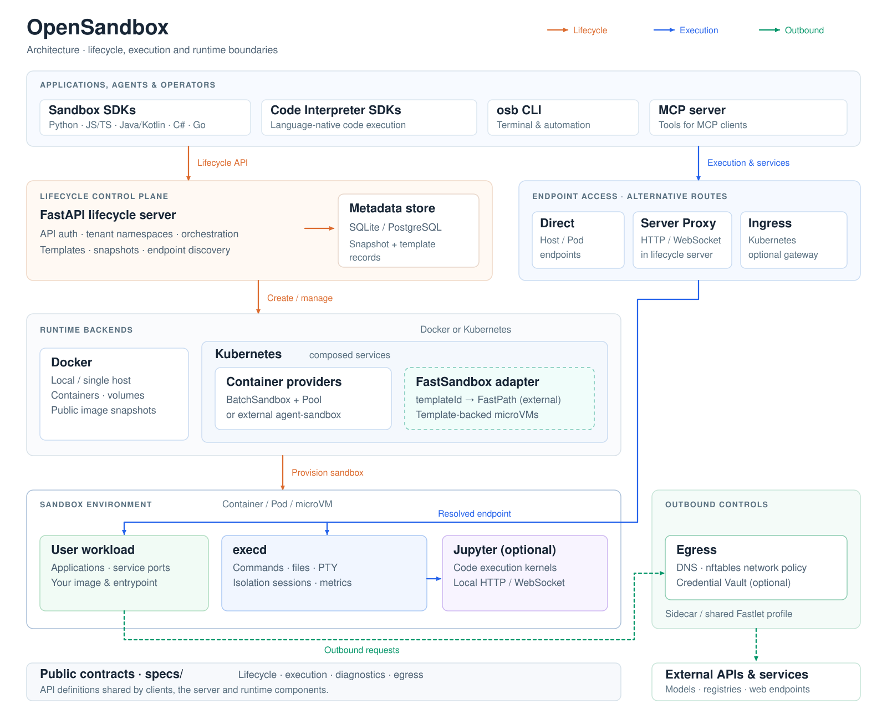

# OpenSandbox Architecture

OpenSandbox is a general-purpose sandbox platform for AI applications. It provides client SDKs and tools, protocol definitions, a lifecycle control plane, Docker and Kubernetes runtime backends (supporting both container workloads and template-backed microVMs), and in-sandbox execution components for commands, files, code interpreters, browser automation, desktop environments, and training workloads.

This document describes the current repository architecture and the main boundaries between public contracts, server implementation, runtime providers, and sandbox data-plane components.

## Architecture Overview



The architecture distinguishes three primary interaction paths:

- **Lifecycle management** (orange arrows): Applications, agents, and operators send lifecycle requests (creating, listing, renewing, pausing, resuming, or deleting sandboxes, as well as managing snapshots and templates) to the FastAPI lifecycle server. The server persists metadata and delegates provisioning and orchestration to the configured runtime backend.
- **Execution and service access** (blue arrows): For command, file, PTY, and Jupyter code execution, or reaching user workload services, clients bypass lifecycle orchestration and connect directly to resolved endpoints—via direct host/pod addresses, the lifecycle server proxy, or an optional Kubernetes ingress gateway.
- **Outbound controls** (green arrows): Outbound requests from the sandbox to external APIs, model providers, or web services can be filtered and secured through egress controls (a per-sandbox sidecar for container workloads or a shared Fastlet egress profile for FastSandbox), with support for DNS/nftables policies and optional Credential Vault secret injection.

Runtime and networking capabilities depend on the selected backend; the diagram shows the shared architecture, not a requirement to deploy every component.

OpenSandbox is organized around six practical surfaces:

1. **Client surface** - SDKs, the `osb` CLI, and the MCP server used by applications, agents, and operators.
2. **Protocol surface** - OpenAPI contracts under `specs/` for lifecycle, diagnostics, in-sandbox execution, and egress policy.
3. **Lifecycle control plane** - the FastAPI server under `server/` that authenticates requests, validates config, persists server-managed records, and delegates lifecycle work to a configured runtime service.
4. **Runtime backends** - Docker for local and single-host deployments, and Kubernetes with container workload providers (BatchSandbox or `kubernetes-sigs/agent-sandbox`) alongside an optional FastSandbox integration for template-backed microVMs.
5. **Sandbox data plane** - the user workload and `execd` daemon inside a container or microVM, with optional Jupyter/code-interpreter support. Volume and egress integration depend on the runtime.
6. **Network and security plane** - endpoint resolution, server proxying, Kubernetes ingress gateway routing, secure endpoint access, egress policy enforcement, credential vault, resource limits, and secure container runtimes.

The split is intentional: SDKs and tools should depend on the public contracts, the server should own lifecycle orchestration, runtime providers should own platform-specific resource creation, and `execd`/egress should own operations that happen from inside the sandbox network and filesystem namespace.

## 1. Client Surface

The client surface is the developer-facing entry point for OpenSandbox.

### 1.1 Sandbox SDKs

The sandbox SDKs wrap lifecycle operations and in-sandbox operations behind language-native APIs:

- Python: `sdks/sandbox/python`
- JavaScript/TypeScript: `sdks/sandbox/javascript`
- Java/Kotlin: `sdks/sandbox/kotlin`
- C#/.NET: `sdks/sandbox/csharp`
- Go: `sdks/sandbox/go`

Common capabilities include:

- Create, list, inspect, pause, resume, renew, and delete sandboxes.
- Resolve service endpoints for sandbox ports.
- Execute commands with streamed output and background status/log polling.
- Manage files and directories.
- Read resource metrics from `execd`.
- Inspect or patch runtime egress policy when an egress sidecar is attached.

Generated OpenAPI clients live beside handwritten adapters. Generated code handles ordinary request/response APIs; handwritten layers cover SDK ergonomics, streaming, transport lifecycle, error mapping, and high-level models.

### 1.2 Code Interpreter SDKs

The code-interpreter SDKs build on the sandbox SDKs and `execd` code execution APIs. They manage code execution contexts and expose language-oriented code execution helpers.

The official code-interpreter image is maintained in [opensandbox-group/sandbox-images](https://github.com/opensandbox-group/sandbox-images) (previously located under `sandboxes/code-interpreter/`; see [Migration Reference](/reference/code-interpreter-image-migration)). It provides Python, Java, Node.js, and Go runtimes, and Jupyter kernels for Python, Java, TypeScript/JavaScript, Go, and Bash. Exact language versions are image-controlled and selected through environment variables such as `PYTHON_VERSION`, `JAVA_VERSION`, `NODE_VERSION`, and `GO_VERSION`.

### 1.3 CLI and MCP

The `osb` CLI under `cli/` is a terminal interface for day-to-day sandbox operations:

- `osb sandbox`: lifecycle and endpoint management
- `osb command`: command execution, background logs, and shell sessions
- `osb file`: file and directory operations
- `osb egress`: runtime egress policy inspection and mutation
- `osb devops`: low-level diagnostics
- `osb skills`: OpenSandbox-specific agent skill installation

The MCP server under `sdks/mcp/sandbox/python` exposes focused sandbox lifecycle, command, and text-file tools to MCP-capable clients such as Claude Code and Cursor.

## 2. Protocol Surface

OpenSandbox treats `specs/` as the public contract source of truth.

### 2.1 Lifecycle API

`specs/sandbox-lifecycle.yml` defines the lifecycle API, served by the server with the base path `/v1`.

Main resource groups:

- **Sandboxes**: create from an image, snapshot, or template; list, get, delete, pause, resume, renew expiration, and resolve port endpoints. FastSandbox also supports inspecting and managing runtime network policy through `GET/PUT/PATCH/DELETE /sandboxes/{sandboxId}/networkpolicy`, and reports the sandbox origin to clients via the `OPEN-SANDBOX-ORIGIN` response header on endpoint lookups.
- **Snapshots**: create a persistent snapshot from a sandbox, list snapshots, get snapshot state, and delete snapshots.
- **Templates**: create, list, inspect, and delete template definitions in the catalog used by FastSandbox (`/templates`).

Important request features:

- `image` or `snapshotId` for container startup, or `templateId` for the FastSandbox path in Kubernetes mode.
- `entrypoint`, environment variables, metadata, and opaque `extensions`.
- `resourceLimits` for CPU, memory, GPU, and future resource keys.
- `platform` constraints.
- `volumes` for host paths, platform-managed named volumes/PVCs, and OSSFS.
- `networkPolicy` for outbound network policy configuration.
- `secureAccess` for Kubernetes ingress gateway deployments that require endpoint credentials.

### 2.2 Diagnostics API

`specs/diagnostic-api.yml` defines best-effort diagnostic descriptors for sandbox logs and events. The server also exposes practical DevOps diagnostics routes that return plain text for operators and AI troubleshooting workflows.

### 2.3 Execd API

`specs/execd-api.yaml` defines the in-sandbox execution API exposed by `components/execd/`.

Main capabilities:

- Health check: `GET /ping`
- Code contexts and execution: `/code/contexts`, `/code/context`, `/code`
- Bash sessions: `/session`
- Commands: `/command`, command status, and background command logs
- Files and directories: `/files/*`, `/directories`
- Metrics: `/metrics`, `/metrics/watch`

Command and code execution use Server-Sent Events for streaming output. The current `execd` implementation also includes interactive PTY WebSocket endpoints under `/pty` for long-lived shell sessions.

### 2.4 Egress API

`specs/egress-api.yaml` defines the runtime policy and credential broker APIs exposed by `components/egress/`:

- **Policy**: `GET /policy` to inspect the current policy; `PATCH /policy` to mutate rules at runtime.
- **Credential Vault**: `GET`, `POST`, `PATCH`, and `DELETE` on `/credential-vault` to manage sandbox-local credential bindings and token injection without exposing raw secrets to the workload.

For container backends, callers resolve the sandbox endpoint for the egress sidecar port and connect directly (forwarding endpoint authentication headers when sidecar auth is enabled). For FastSandbox, runtime network policy is managed through the lifecycle API (`/sandboxes/{sandboxId}/networkpolicy`), while the shared Fastlet profile routes policy and per-subject credential vault operations using internal request headers.

## 3. Lifecycle Control Plane

The lifecycle server under `server/` is a FastAPI application. It owns request validation, API-key authentication, server configuration, lifecycle orchestration, endpoint formatting, diagnostics, and server-managed persistence.

### 3.1 Server Structure

Key packages:

- `opensandbox_server/main.py`: app startup, middleware, router registration, runtime validation, and renew-intent startup.
- `opensandbox_server/api/`: lifecycle routes, proxy routes, pool routes, diagnostics routes, and request/response schemas.
- `opensandbox_server/services/`: lifecycle service interfaces and Docker/Kubernetes implementations.
- `opensandbox_server/services/k8s/`: Kubernetes workload providers, endpoint resolution, volume/egress helpers, informer support, and provider-specific mapping.
- `opensandbox_server/repositories/`: persistence adapters, used for server-managed snapshot records and the FastSandbox template catalog.
- `opensandbox_server/integrations/renew_intent/`: optional auto-renew-on-access integration.
- `opensandbox_server/middleware/`: API-key authentication and request ID middleware.

### 3.2 Runtime Service Selection

The server selects its lifecycle implementation based on `[runtime].type`:

- `docker` -> `DockerSandboxService`
- `kubernetes` -> `CompositeSandboxService`, which combines `KubernetesSandboxService` (backed by BatchSandbox or agent-sandbox providers) with `FastSandboxService` for template-based microVM execution.

The top-level `runtime.type` configuration option remains strictly `docker` or `kubernetes`. All implementations satisfy the same `SandboxService` interface, keeping API routes thin and delegating behavior to services. Under Kubernetes mode, `CompositeSandboxService` inspects creation requests: requests specifying a `templateId` dispatch to `FastSandboxService`, while container requests specifying an `image` or `snapshotId` dispatch to `KubernetesSandboxService`. Operations on existing sandboxes are routed by their ID prefix (IDs starting with `fsb-` route to `FastSandboxService`). Runtime-specific details stay behind the service boundary.

### 3.3 Server Persistence

The `[store]` configuration selects SQLite (the default, at `~/.opensandbox/opensandbox.db`) or PostgreSQL. The server persists snapshot metadata and the FastSandbox template catalog through separate repository adapters (`repositories/snapshots/` and `repositories/templates/`). The template catalog stored in the database is the public source of truth; Kubernetes `SandboxTemplate` resources drive golden-image builds and provide asynchronous status updates.

### 3.4 Server Proxy and Endpoint Resolution

The lifecycle endpoint API returns the reachable address for a service port inside a sandbox. Depending on runtime and configuration, the endpoint may be:

- A Docker host/bridge mapped endpoint.
- A Kubernetes ingress gateway endpoint.
- A server-proxied URL under `/sandboxes/{sandboxId}/proxy/{port}` when `use_server_proxy=true`.

Header-routed ingress endpoints include `OpenSandbox-Ingress-To` in their endpoint metadata.
When the endpoint is rewritten to a server-proxied URL, the server removes only this
ingress routing header and preserves other required endpoint headers.

The server proxy supports HTTP and WebSocket traffic and is also integrated with optional renew-on-access behavior. For HTTP responses, it strips hop-by-hop headers and the backend `Server` header while preserving an origin `Date`; the server adds a current `Date` only when the response does not already contain one. A root-relative `Location` value that starts with a single `/` is rebased under the same sandbox proxy route, while absolute URLs, network-path references (`//host/path`), and ordinary path-relative values are forwarded unchanged.

HTTP proxy responses preserve the sandbox service's status code, body, and `Content-Type`, including redirects and backend errors. The generated Server OpenAPI describes `200` and `default` responses with `*/*` and no fixed payload schema because the sandbox service controls the payload. Server-side validation and authentication still apply before forwarding; the explicit `422` validation response remains documented. These response declarations cover both root and `/v1` aliases, with and without a backend path, for every supported HTTP method.

## 4. Runtime Backends

### 4.1 Docker Runtime

The Docker runtime is the local and single-host backend. It talks directly to the Docker daemon and manages containers, timers, labels, volumes, ports, optional sidecars, and snapshots.

Core responsibilities:

- Pull public or private images, including per-request registry authentication.
- Create containers with CPU, memory, GPU, platform, capability, AppArmor, seccomp, PID, and secure-runtime settings.
- Stage the `execd` binary from `[runtime].execd_image` into the sandbox and install a bootstrap launcher before starting the user entrypoint.
- Support network modes `host`, `bridge`, and custom user-defined networks.
- Allocate host ports for `execd` and user service endpoints in non-host network modes.
- Restore expiration timers for existing managed containers after server restart.
- Support host bind mounts, Docker named volumes via the `pvc` volume model, and OSSFS-backed mounts.
- Attach an egress sidecar when `networkPolicy` is requested and Docker networking is compatible.
- Create Docker-backed persistent snapshots as local images and restore sandboxes from those snapshot images.

Docker pause/resume uses container-level pause/resume. For sandboxes with an egress sidecar,
pause freezes the sandbox container before the sidecar, while resume unfreezes the sidecar
before the sandbox container. Docker snapshots are exposed through the public snapshot API.

### 4.2 Kubernetes Runtime

The Kubernetes runtime delegates actual workload creation to a workload provider selected by `kubernetes.workload_provider`.

Supported providers:

- `batchsandbox` - the default provider backed by OpenSandbox's Kubernetes controller and `BatchSandbox` CRD.
- `agent-sandbox` - a provider for `kubernetes-sigs/agent-sandbox`.

The Kubernetes server path handles:

- Kubernetes client initialization and optional informer-backed reads.
- Workload creation from image requests; `snapshotId` startup resolves to a stored restorable image when the snapshot record supports restore.
- Template merging for BatchSandbox and agent-sandbox manifests.
- Per-request image pull secrets where the provider supports them.
- Resource limits and GPU translation to Kubernetes extended resources.
- Platform constraints and RuntimeClass integration for secure runtimes.
- Volumes, egress sidecars, and secure endpoint access annotations.
- Endpoint resolution through direct workload data or ingress gateway configuration.
- Pause/resume delegation to providers.
- Plain-text diagnostics from Kubernetes resources.

### 4.3 BatchSandbox Controller

The Kubernetes controller under `kubernetes/` implements OpenSandbox-specific CRDs for high-throughput and pooled sandbox delivery:

- `BatchSandbox`: create one or many sandbox replicas from a pod template.
- `Pool`: maintain pre-warmed resources for fast allocation.
- `SandboxSnapshot`: snapshot records used by BatchSandbox pause/resume and the public snapshot workflow.

BatchSandbox supports both template-based creation and pool-based creation via `extensions.poolRef`. It also supports optional task orchestration for batch and RL-style workloads.

For supported single-replica BatchSandbox workloads, the rootfs pause/resume path commits the sandbox filesystem to an OCI image and releases runtime resources; resume recreates the workload from that image while preserving the sandbox ID. Workloads configured with a QEMU snapshot contract use a VM-state checkpoint and restore path instead.

The public snapshot API supports Docker and compatible `BatchSandbox` workloads. `DockerSnapshotRuntime` commits containers to local images, while `KubernetesSnapshotRuntime` creates a public `SandboxSnapshot` CR to commit and push images to an OCI registry. This is distinct from internal pause/resume, which releases compute while preserving sandbox continuity. Public snapshot support does not extend to every Kubernetes provider or VM runtime.

### 4.4 FastSandbox Integration

In Kubernetes mode, `FastSandboxService` connects OpenSandbox to the external `fast-sandbox` platform for template-backed microVM provisioning:

- **Routing**: `CompositeSandboxService` routes create requests with `templateId` to `FastSandboxService`, and routes operations on existing sandboxes by the `fsb-` ID prefix. FastSandbox is part of the Kubernetes composition, not a separate `runtime.type` value.
- **Control Protocol**: Communicates with an external `fast-sandbox` control plane via gRPC FastPath v2 (port 9090).
- **State**: FastPath owns mutations and live runtime operations; Kubernetes LIST/WATCH reads persisted `sandbox.fast.io/v1alpha2` resources and their observations.
- **Pause/resume**: Delegates to FastPath, which restores the checkpoint on resume. Clients must resolve endpoints again after restoration.
- **Networking**: The configured Fastlet pool supplies a shared Egress profile; the adapter sends network policy through FastPath Actions. This differs from attaching a per-sandbox container sidecar. The current server adapter rejects the `credentialProxy.enabled` creation flag and volume mounts on this path.

The adapter and endpoint integration live in this repository; FastPath and the microVM runtime are provided by the external platform. See the [service dispatch](https://github.com/opensandbox-group/OpenSandbox/blob/main/server/opensandbox_server/services/composite_service.py) and [FastSandbox adapter](https://github.com/opensandbox-group/OpenSandbox/blob/main/server/opensandbox_server/services/fast_sandbox/service.py) for the implementation boundaries.

## 5. Sandbox Data Plane

Each sandbox runs the user's image and entrypoint, with OpenSandbox control processes injected around it.

### 5.1 Execd

`components/execd/` is a Go daemon built with Gin. It runs inside the sandbox and exposes the execution API.

Responsibilities:

- Shell command execution with SSE streaming.
- Background command status and incremental log retrieval.
- Persistent bash sessions.
- Interactive PTY sessions over WebSocket.
- File and directory operations.
- Process isolation sessions for executing commands in isolated environments.
- Jupyter-backed code contexts and code execution.
- Local CPU/memory metrics and optional OpenTelemetry metrics export.
- Optional shared access token enforcement through `X-EXECD-ACCESS-TOKEN`.

In Docker, the server stages `execd` into the container and installs a bootstrap script. In Kubernetes BatchSandbox template mode, an init container copies `execd` and `bootstrap.sh` from the configured `execd_image` into an `emptyDir` volume mounted by the main sandbox container.

For FastSandbox, the template build includes `execd` in the guest image before the microVM starts.

### 5.2 Code Interpreter Runtime

The code-interpreter sandbox image starts Jupyter inside the sandbox. `execd` talks to Jupyter over HTTP/WebSocket and translates Jupyter kernel messages into OpenSandbox streaming events.

The Code Interpreter SDKs are optional high-level clients. The lower-level execution API remains available through the sandbox SDKs and direct `execd` clients.

### 5.3 Volumes

The lifecycle API exposes runtime-neutral volume models:

- `host`: bind a permitted host path.
- `pvc`: platform-managed named storage. Docker maps this to a Docker named volume; Kubernetes maps it to a PersistentVolumeClaim.
- `ossfs`: mount Alibaba Cloud OSS through the server/runtime integration.

Runtime providers validate and materialize these volume definitions differently, but the API shape stays shared. Volume mounts are supported for Docker and Kubernetes container workloads; the FastSandbox adapter currently rejects volume mounts.

### 5.4 Egress Sidecar

`components/egress/` enforces outbound network policy and provides credential proxying for sandboxes.

Capabilities:

- FQDN and wildcard-domain allow/deny rules.
- `dns` mode for DNS filtering.
- `dns+nft` mode for DNS plus nftables enforcement of resolved IPs and CIDR/IP rules where supported.
- Credential Vault / Proxy: transparent TLS MITM proxy (active in `dns+nft` mode) that provides scoped credential injection for outbound HTTPS requests based on host-managed secret bindings, keeping raw secrets out of the sandbox workload.
- Runtime policy inspection and patching through `/policy`.
- Optional sidecar authentication.
- Optional platform-enforced always-allow and always-deny overlays.

Docker starts the egress sidecar as a separate container and runs the main sandbox container in the sidecar network namespace. Kubernetes container providers append the egress sidecar to the pod spec and drop `NET_ADMIN` from the main sandbox container so only the sidecar mutates network rules. FastSandbox uses the shared Fastlet profile outside the microVM guest, receiving policy actions through FastPath.

## 6. Networking and Access

### 6.1 Ingress

`components/ingress/` is a Kubernetes-oriented HTTP/WebSocket reverse proxy. It watches sandbox resources and routes traffic to sandbox ports.

Supported routing modes:

- Header mode: `OpenSandbox-Ingress-To: <sandbox-id>-<port>` or host parsing.
- URI mode: `/<sandbox-id>/<port>/<path>`.
- Wildcard host mode through server endpoint formatting.

For `BatchSandbox`, ingress reads endpoint data from the `sandbox.opensandbox.io/endpoints` annotation. For `agent-sandbox`, it reads `status.serviceFQDN`.

For FastSandbox routes, ingress asks FastPath to resolve the endpoint and forwards traffic through the returned Fastlet or central proxy address.

### 6.2 Secure Access

`secureAccess` is currently supported for Kubernetes sandboxes exposed through ingress gateway mode. When enabled, the server provisions endpoint credentials and returns required headers with endpoint responses. Signed route tokens are also supported when gateway secure-access signing keys are configured.

### 6.3 Auto-Renew on Access

The optional renew-intent integration extends sandbox TTL when access is observed. It can be triggered by server proxy requests or by ingress gateway events delivered through Redis. Per-sandbox opt-in is controlled by the `extensions["access.renew.extend.seconds"]` create parameter.

## 7. Core Flows

### 7.1 Sandbox Creation

```text
Client / SDK / CLI / MCP
  -> POST /v1/sandboxes
  -> FastAPI lifecycle server validates request and config
  -> selected service creates a Docker container, Kubernetes workload, or FastSandbox microVM
  -> runtime stages execd or uses a prepared guest image, with backend-specific networking and storage
  -> sandbox reaches Running or reports Failed with status reason/message
```

Creation is asynchronous from the API perspective. Clients should poll `GET /v1/sandboxes/{sandboxId}` or use SDK readiness helpers.

### 7.2 Command, File, and Code Execution

```text
Client
  -> resolve execd endpoint from sandbox metadata or server proxy
  -> call execd API with X-EXECD-ACCESS-TOKEN when required
  -> execd runs command, file operation, session, PTY, or Jupyter code execution
  -> execd streams SSE/WebSocket output or returns structured responses
```

### 7.3 Service Exposure

```text
Client
  -> GET /v1/sandboxes/{sandboxId}/endpoints/{port}
  -> server returns Docker-mapped, ingress-gateway, or server-proxy endpoint
  -> client includes returned headers when secure access or sidecar auth requires them
  -> HTTP/WebSocket traffic reaches the target sandbox port
```

### 7.4 Egress Policy

```text
Create request with networkPolicy
  -> server validates runtime-specific network policy settings
  -> runtime attaches egress sidecar or binds policy actions to shared Fastlet profile
  -> sandbox outbound DNS/network traffic is filtered
  -> FastSandbox clients manage policy via GET/PUT/PATCH/DELETE /v1/sandboxes/{sandboxId}/networkpolicy
  -> container clients resolve the egress endpoint and PATCH /policy
```

### 7.5 Pause, Resume, and Snapshots

```text
Pause / resume
  -> lifecycle server delegates to runtime provider
  -> Docker pauses/resumes the sandbox container and its egress sidecar when present
  -> BatchSandbox uses rootfs commit/recreate or the configured QEMU VM-state restore path
  -> FastSandbox delegates pause/resume to external FastPath v2 service

Public snapshot API
  -> server persists snapshot metadata
  -> Docker runtime commits the sandbox to a local OCI image
  -> Kubernetes runtime (scoped to BatchSandbox) creates a public SandboxSnapshot CR that commits and pushes to an OCI registry
  -> create-from-snapshot resolves that image and starts a new sandbox
```

## 8. Design Principles

### Protocol First

Public behavior starts from OpenAPI contracts in `specs/`. SDKs and clients should align to those contracts, and generated outputs should be regenerated from source specs rather than patched as the only fix.

### Control Plane vs Data Plane

The lifecycle server should orchestrate and validate. Platform-specific provisioning belongs in runtime services/providers. In-sandbox operations belong in `execd` and egress sidecars.

### Runtime Neutral API, Runtime Specific Execution

The lifecycle API uses shared concepts such as resource limits, volumes, endpoints, network policy, and metadata. Docker and Kubernetes can materialize those concepts differently while preserving the API contract.

### Secure Defaults with Explicit Escape Hatches

The server supports API-key authentication, startup guardrails for unauthenticated mode, resource limits, capability drops, optional secure runtimes, egress controls, endpoint headers, and platform-specific network isolation. Less restrictive modes are intended for local development or explicit operator choice.

### Observable Failures

Sandbox state includes `state`, `reason`, `message`, and transition time. `execd` exposes metrics, the server exposes diagnostics, ingress/egress/execd support logs and OpenTelemetry metrics where implemented, and request IDs are propagated for debugging.

## 9. Common Use Cases

- **Coding agents**: run Claude Code, Gemini CLI, Codex CLI, Qwen Code, Kimi CLI, or other agent tools in isolated sandboxes.
- **AI code execution**: execute model-generated code with command/file/code-interpreter APIs and streamed feedback.
- **Browser automation**: run Chrome or Playwright with controlled filesystem and network behavior.
- **Remote development**: expose VS Code Web, desktops, VNC, or development servers through sandbox endpoints.
- **RL and evaluation workloads**: use Kubernetes BatchSandbox, Pool, and task orchestration for high-throughput sandbox delivery.
- **Enterprise isolation**: combine secure runtimes, ingress, egress, endpoint access headers, and Kubernetes deployment controls.

## 10. References

- [Getting Started](/getting-started/)
- [Sandbox Lifecycle Spec](https://github.com/opensandbox-group/OpenSandbox/blob/main/specs/sandbox-lifecycle.yml)
- [Diagnostics Spec](https://github.com/opensandbox-group/OpenSandbox/blob/main/specs/diagnostic-api.yml)
- [Sandbox Execution Spec](https://github.com/opensandbox-group/OpenSandbox/blob/main/specs/execd-api.yaml)
- [Egress Spec](https://github.com/opensandbox-group/OpenSandbox/blob/main/specs/egress-api.yaml)
- [Server](/components/server)
- [Server Configuration](https://github.com/opensandbox-group/OpenSandbox/blob/main/server/configuration.md)
- [Execd](/components/execd)
- [Ingress](/components/ingress)
- [Egress](/components/egress)
- [Kubernetes](/kubernetes/)
- [Pause and Resume](/guides/pause-resume)
- [Secure Container Runtime Guide](/guides/secure-container)
- [Credential Vault](/guides/credential-vault)
- [Network Isolation](/architecture/network-isolation)
- [CLI](/cli/)
- [MCP Server](/sdks/mcp)
- [Examples](/examples/)
